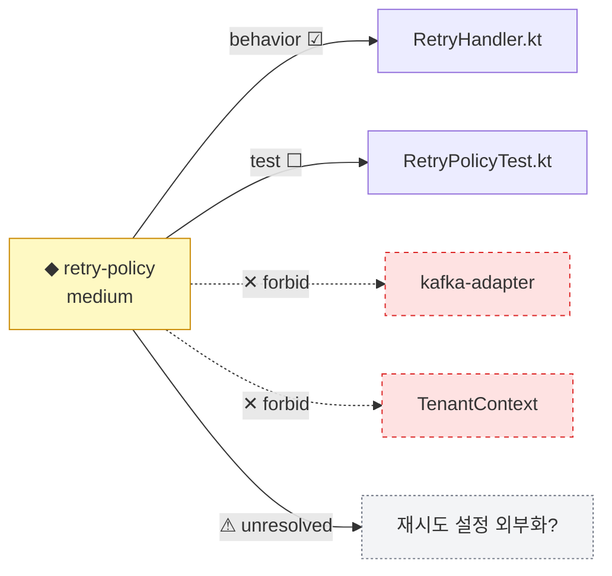

# Change Map — A Notation for Agentic Change

> **이 문서의 위치.** ACG의 의사소통 축. 사용자가 요구한 "UML과 같은 사람-에이전트 의사소통 도구"에 대한 답이다. UML은 *클래스·시퀀스·상태* 같은 **정적 구조**를 그리는 표기였다. agentic 시대의 병목은 구조가 아니라 **변경**이다 — agent가 무엇을 왜 바꿨고, 어디까지 번지며, 무엇이 위험하고, 무엇이 검증됐는가. Change Map은 이 다섯 질문을 한 장에 담는 표기법이다. [20-contracts.md](20-contracts.md)의 ReviewGraph·ImpactGraph·ChangeContract를 사람이 읽는 형태로 렌더한다.

## 0. 설계 원칙

| 원칙 | 이유 |
|---|---|
| **변경이 1급 노드** | UML의 노드는 클래스(구조). Change Map의 중심 노드는 *변경 그 자체*다 |
| **exception만 강조** | 사람은 전체 diff가 아니라 봐야 할 것만 본다(Review by Exception). 저위험은 접힘 |
| **증거가 1급 시각요소** | 각 acceptance/영향에 증거 상태(닫힘/열림/미검증)가 뱃지로 붙는다 |
| **텍스트가 정본** | 다이어그램은 파생. 정본은 파싱·diff·버전관리 가능한 텍스트 |
| **단일 출처** | ICL/ReviewGraph에서 자동 생성. 손으로 그리지 않는다([30](30-intent-change-dsl.md) 컴파일 타깃 C) |

UML과의 대비를 한 줄로: **UML은 "시스템이 어떻게 생겼나"를, Change Map은 "이 변경이 무엇을 하나"를 그린다.**

## 1. 어휘 (다섯 요소)

Change Map은 다섯 종류의 시각 요소만 쓴다. 적을수록 빨리 읽힌다.

| 요소 | 기호 | 표현하는 것 | 출처 |
|---|---|---|---|
| **변경 노드** | `◆` | 하나의 변경(의도·목적·위험도) | ChangeContract |
| **범위 경계** | `─` allow / `✕` forbid | 건드려도 되는/안 되는 영역 | ChangeContract scope |
| **영향 엣지** | `→` | 변경이 전파되는 방향과 종류 | ImpactGraph |
| **위험 색** | 🟢🟡🔴 | low/medium/high | ReviewGraph |
| **증거 뱃지** | `☑`닫힘 `☐`열림 `⚠`미검증 | acceptance·영향의 검증 상태 | EvidenceContract |

### 위험 색의 규칙

- 🔴 **high**: public API·migration·auth·payment·data deletion·forbidden 침범·미검증 의미변경·**사용자 여정 영향·미검증 제품 영향**. **항상 펼쳐서** 사람에게 노출.
- 🟡 **medium**: production behavior 연결 변경·인터페이스 도입·계층 이동·**UI 표면 변경**. 요약만, 펼침은 선택.
- 🟢 **low**: 내부 helper·테스트 fixture·포맷. **기본 접힘.**

## 2. 텍스트 표기 (정본)

Change Map의 정본은 텍스트다. 사람이 읽고, diff로 비교하고, 버전관리되며, 다이어그램으로 렌더된다.

### 2.1 단일 변경 표기

```text
◆ <change-id> [<risk>] "<purpose>"
  decision: <ADR id 또는 —>
  scope:
    allow ─ <scope refs>
    forbid ✕ <scope refs>
  impact:
    → <kind> <path> <증거뱃지>
    → ...
    ⚠ unresolved: <kind> <path> — <reason>
  accept:
    ☑/☐ "<criterion>" (<evidence_kind>)
  ! <rationale 또는 exception note>
```

### 2.1b 최소 문법 (EBNF)

"파싱 가능한 정본"이라는 주장을 뒷받침하기 위해 텍스트 표기에 형식 문법을 둔다(OBJ-14 반영). 이로써 다음 agent·verifier가 관례가 아니라 grammar로 파싱한다 — 즉 Change Map은 표시 산출물이 아니라 거버넌스 산출물이다.

```ebnf
change_map   = change_node , { change_node } ;
change_node  = "◆" , id , risk_badge , quoted ,
               [ "decision:" , (id | "—") ] ,
               "scope:" , "allow" , "─" , scope_list , "forbid" , "✕" , scope_list ,
               [ "impact:" , { impact_edge } ] ,
               "accept:" , { accept_line } ,
               { note_line } ;
impact_edge  = "→" , impact_kind , ref , evidence_badge
             | "⚠" , "unresolved:" , unresolved_kind , ref , "—" , reason ;
(* impact_kind/unresolved_kind는 [20](20-contracts.md) §2 ImpactGraph enum을 그대로 import — 표기와 스키마 어휘 불일치 금지(OBJ-23) *)
impact_kind     = "direct_caller" | "transitive_caller" | "type_contract"
                | "generated_client" | "test" | "doc" | "external_surface"
                | "ui_surface" | "user_journey" ;
unresolved_kind = "dynamic_call" | "reflection" | "string_dispatch"
                | "config_driven" | "cross_repo" | "journey_unknown" ;
ref             = path | journey_id ;   (* user_journey/ui_surface면 journey_id, 그 외 path *)
accept_line  = evidence_state , quoted , "(" , evidence_kind , ")" ;
evidence_kind   = "test" | "build" | "log" | "diff" | "screen" | "manual" | "e2e" ;  (* 20 §1과 일치 *)
risk_badge      = "🟢[low]" | "🟡[medium]" | "🔴[high]" ;
evidence_badge  = "☑" | "☐" | "⚠" ;
evidence_state  = "☑" | "☐" ;
note_line       = "!" , string ;
```

changeset 요약 표기(§2.3)는 이 `change_node`를 risk_badge 기준으로 그룹핑한 것이다. 다이어그램(§3)은 이 문법에서 파생되며, 불일치 시 텍스트가 정본이다.

### 2.2 예시 (boxwood 재시도 정책 — [30](30-intent-change-dsl.md)의 ICL에서 자동 생성)

```text
◆ retry-policy 🟡[medium] "재시도를 지수 백오프로"
  decision: ADR-automation-0007
  scope:
    allow ─ automation-engine/**/runtime/**, .../test/RetryPolicy*
    forbid ✕ kafka-adapter  ✕ external-client contract  ✕ TenantContext
  impact:
    → direct_caller automation-engine/.../RetryHandler.kt ☑
    → test .../RetryPolicyTest.kt ☐
    → user_journey jrn-process-run ☐
    ⚠ unresolved: config_driven 재시도 설정 외부화 여부 — 런타임 프로퍼티 확인 필요
  accept:
    ☐ "재시도 간격 1s,2s,4s" (test)
    ☐ "기존 RetryPolicy 테스트 통과" (test)
  ! rationale: 커버리지 2.7% → characterization 선행. tenant 격리는 fitness gate로 지속 감시.
```

읽는 사람은 즉시 안다: medium 위험, 두 acceptance가 아직 열림(☐), unresolved 하나, forbidden 3개가 보호됨.

### 2.3 변경 집합(changeset) 요약 표기

여러 변경을 한 PR/세션에서 본다면, 위험도로 접어서 요약한다(Review by Exception).

```text
CHANGESET wi_260603xxx — 18 files

🔴 high (2) ── 펼침
  ◆ payment-state-migration "결제 상태 컬럼 추가"
    impact → migration migrations/20260603_add_payment_state.sql ☐
    accept ☐ "기존 invoice contract test 통과" (test)
    ! 사람 판단 필요: 롤백 전략 미정. Flyway repair 이력 있음.
  ◆ payment-service-behavior "환불 처리 분기 변경"
    accept ☑ "환불 단위테스트" (test)  ☐ "통합 시나리오" (manual)
    ! 사람 판단 필요: public method behavior 변경.

🟡 medium (4) ── 요약
  service 내부 분기(2), retry 정책(1), 인터페이스 도입(1)

🟢 low (12) ── 접힘 [펼치려면 expand]
  private helper rename, 테스트 fixture, 포맷

HUMAN REVIEW SET:
  - migrations/20260603_add_payment_state.sql
  - portal-backend/.../PaymentService.kt
```

18개 파일 중 사람이 봐야 할 것은 2개. 이것이 review-surface reduction([00](00-framework.md) §8 지표)이다.

## 3. 다이어그램 규칙 (파생)

텍스트 정본에서 다이어그램을 생성하는 규칙. Mermaid를 1차 타깃으로 한다(대부분의 마크다운 뷰어가 렌더, 텍스트라 diff 가능).

### 3.1 변경-영향 그래프



### 3.2 렌더 규칙

| 텍스트 요소 | 다이어그램 매핑 |
|---|---|
| `◆ 변경 노드` | 중심 노드, 위험색으로 채움 |
| `→ impact` (handled) | 실선 화살표 + 증거뱃지 라벨 |
| `✕ forbid` | 점선 화살표(red, dashed), forbid 스타일 |
| `⚠ unresolved` | 점선 + 회색, unresolved 스타일 |
| 위험색 | high=red, medium=amber, low=green |

> 다이어그램은 항상 텍스트에서 생성되며, 손으로 그린 다이어그램은 정본이 아니다. 텍스트↔다이어그램 불일치가 생기면 텍스트가 이긴다.

## 4. 무엇을 그리지 않는가 (UML과의 차이)

Change Map은 UML이 아니다. 의도적으로 그리지 않는 것:

- **정적 클래스 구조** — 그것은 코드/기존 도구의 몫. Change Map은 *변경*만 그린다.
- **전체 시퀀스** — 변경의 영향 전파만, 시스템 전체 흐름은 아니다.
- **구현 세부** — "어떻게"는 코드에 있다. 지도는 "무엇을·어디까지·얼마나 위험하게·검증됐는지"만.

이 절제가 핵심이다. UML이 비대해진 이유는 모든 것을 그리려 했기 때문이다. Change Map은 한 변경의 거버넌스 판단에 필요한 다섯 요소만 그린다.

## 5. 소비 시나리오

| 소비자 | 무엇을 보나 |
|---|---|
| **사람 리뷰어** | changeset 요약 → HUMAN REVIEW SET의 exception만 펼쳐 판단 |
| **다음 agent** | 텍스트 정본을 파싱해 미해소(☐⚠) 항목을 인수 |
| **verifier** | 증거뱃지 ☑가 실제 증거와 일치하는지 교차검증 |
| **추세 분석** | changeset들의 위험 분포·exception 비율을 시계열로(Assurance) |

## 6. 다음 문서 / 닫는 말

Change Map은 ACG 산출물의 **사람 쪽 끝단**이다. ICL([30](30-intent-change-dsl.md))이 의도를 받는 입력 끝단이라면, Change Map은 변경을 사람에게 돌려주는 출력 끝단이다. 그 사이를 [10-methodology.md](10-methodology.md)의 lifecycle과 [20-contracts.md](20-contracts.md)의 스키마가 잇는다.

- 시각화의 원천 스키마 → [20-contracts.md](20-contracts.md) (ReviewGraph·ImpactGraph)
- 자동 생성 경로 → [30-intent-change-dsl.md](30-intent-change-dsl.md) 컴파일 타깃 (C)
- 프레임워크 전체 → [00-framework.md](00-framework.md)
